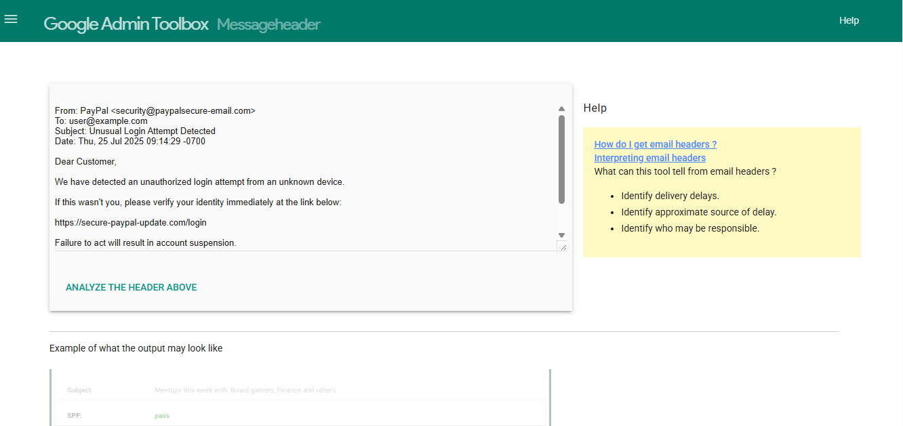
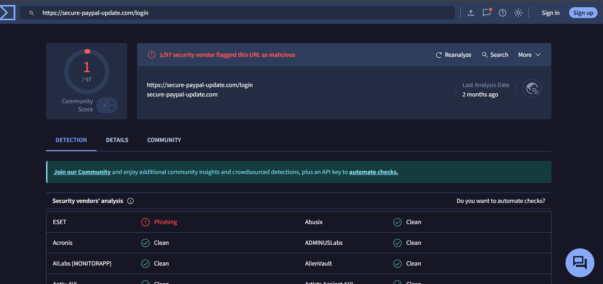
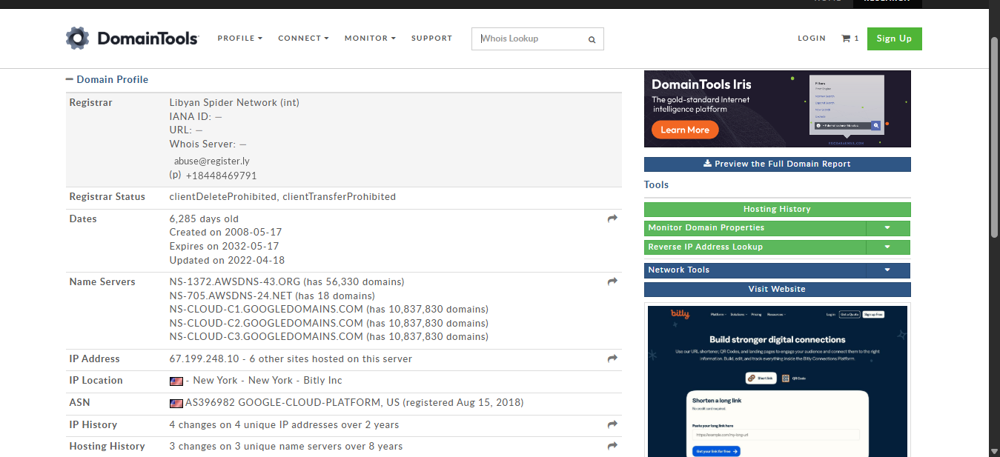

## Phishing Incident Response Simulation

## objectives

- Analyze a simulated phishing email
- Identify and extract IOCs (URLs, IPs, domains)
- Use public tools (VirusTotal, URLScan.io, WHOIS)
- Document the investigation with a formal incident report

---

##  Tools Used

| Tool        | Purpose                             |
|-------------|-------------------------------------|
| Email Header Analyzer | Understand mail routing, spoofing |
| VirusTotal  | Detect malicious URLs/files         |
| URLScan.io  | Simulate site behavior              |
| WHOIS/IPInfo | Reveal domain & hosting details     |

---

##  Email Sample (Used in This Simulation)

- Sender: PayPal <security@paypalsecure-email.com>
- Subject: Unusual Login Attempt Detected
- Link: <https://secure-paypal-update.com/login> 
- Body: See <https://github.com/Ibrahim-Ajao/Email-Sample/blob/main/README.md> for full content.

---

## Analysis Steps

- Header parsed via [Google MessageHeader Tool](https://toolbox.googleapps.com/apps/messageheader/)
- URL scanned via VirusTotal & URLScan.io
- Domain WHOIS and IP address info extracted and verified
- All steps and findings summarized in the final report

---

##  Sample IOCs (Indicators of Compromise)

- secure-paypal-update.com
- Domain IP: 203.0.113.44
- Created: July 20, 2025
- Flags: Phishing, typo domain, Whois privacy

---

## Final Report Location

<https://github.com/Ibrahim-Ajao/Final-phishing-incident-report/blob/main/README.md>

---
## Screenshots from tools used

## Email Header Analyzer

## Virustotal

## WHOIS/IPInfo

---
